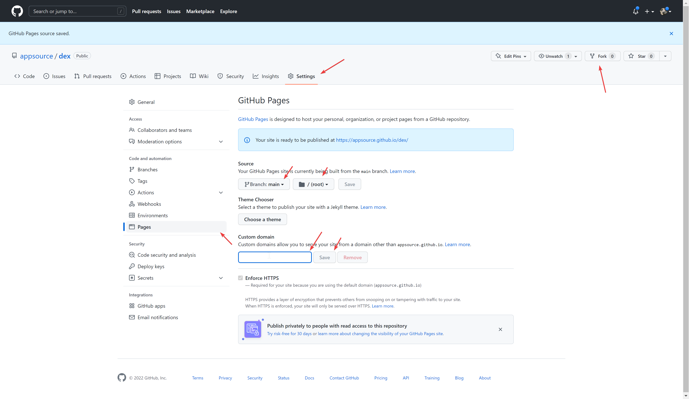

# Lottery creation tool
(EVM) Lottery White-label at your own domain without coding skills. 2 CLICK INSTALLATION, JUST FORK AND ADD DOMAIN

Video: https://www.youtube.com/watch?v=2uoRozFB31M&list=PLLtijyRvdwnYLjAdHtCthK3vRXf1CHpij&index=2

# Pricing: 1/5 of your profit as a fee or ~1500 USD at once
As an administrator, you have two options to manage the fees associated with the lottery service:

1) Service fee: You have the option to set a service fee for each round of the lottery. The service fee is transferred to your wallet address, and a portion of this fee, equal to 1/5 of the service fee, is deducted as the "onout.org" fee. This fee can be removed by purchasing the premium version of the lottery service.

2) Unclaimed funds: You have the option to withdraw unclaimed funds from the bank after one months have passed since the last round of the lottery. However, please be aware that a portion of the withdrawal, equal to 1/5 of the total amount, will be deducted as the OnOut fee. If you wish to avoid this fee, you can purchase the premium version of the lottery service.

# howto
1. fork this repo
2. go to settings (check the addreass github/YOURNAME/lottery, not https://github.com/appsource/lottery/!) and enable Github pages

3. add your "custom domain" (don't forget to change DNS of your domain. <a href="https://www.youtube.com/watch?v=EX4w9hsduNA" target="_blank">video tutorial</a>)
4. open your domain (https://yourdomain.com/) and follow the installation master

To add a private chain please contact https://t.me/onoutsupportbot or email support@onout.org (read more https://support.onout.org/hc/1331700057/32/addnewnetwork?category_id=8 )

